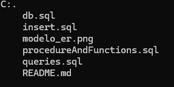

# Filtro_PostgreSQL_MachucaCamilo
Este proyecto trata sobre La tienda TechZone el cual es un negocio de ventas de productos tecnologicos.

## Descripción
Esta base de datos cuenta con un sistema que registre todos los productos disponibles en la tienda, clasificándolos por categoría y manteniendo un seguimiento de la cantidad en stock.

## Tecnologias utilizadas
- PostgreSQL
- drawio

## Estructura del proyecto

## configuración 
- **modelo_er.png:**  Imagen del modelo Entidad-Relación.
- **db.sql:**  Script de creación de la base de datos y tablas.
- **sert.sql:**  Script para insertar datos de prueba en la base de datos.
- **queries.sql** Conjunto de consultas avanzadas para análisis de datos.
- **procedureAndFunctions.sql:**  Procedimiento almacenado para gestionar ventas con
transacciones.
- **README.md:** Documentación del proyecto y guía de uso.

## Desarrollado por
Este proyecto fue desarrollado por Camilo Machuca Vega como proyecto filtro postgreSQL.